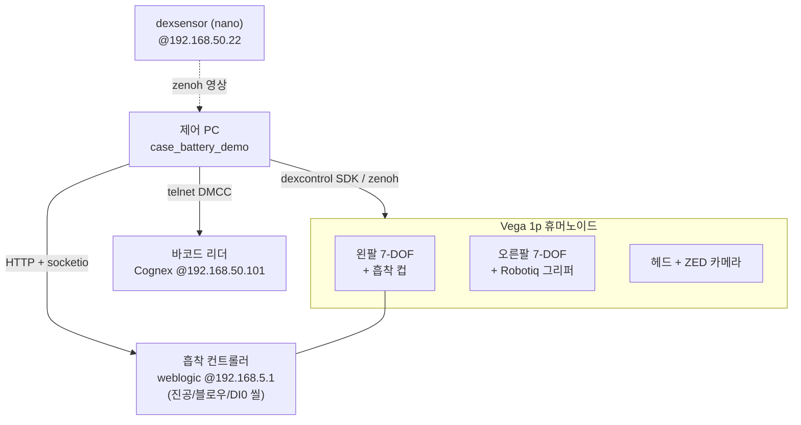
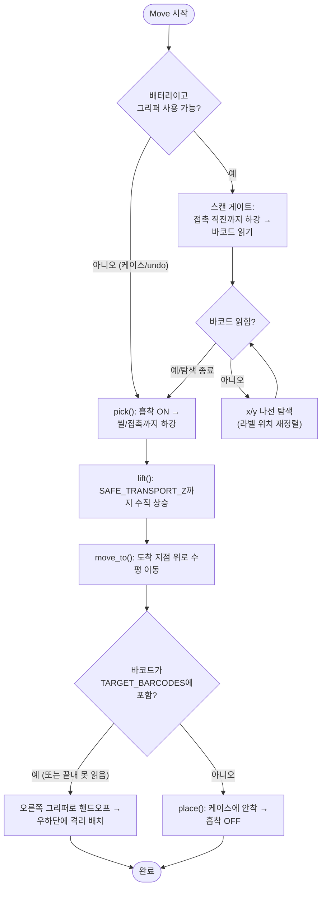
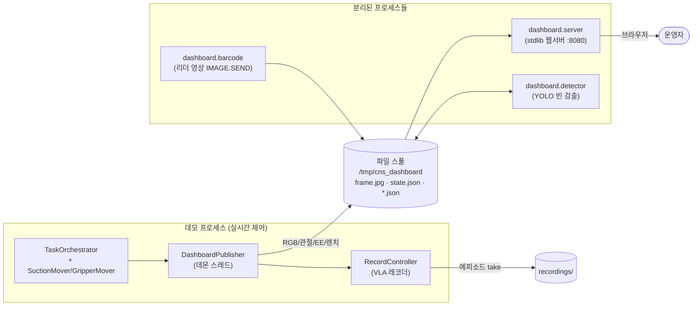
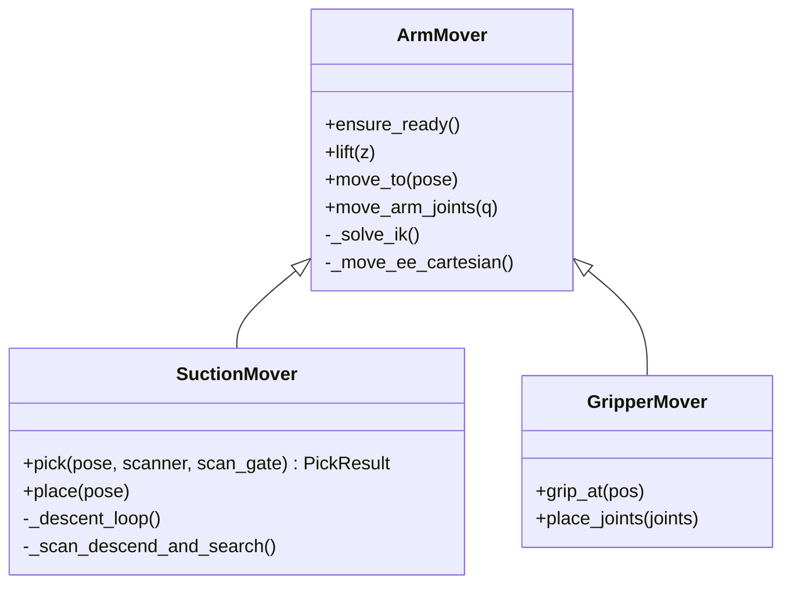
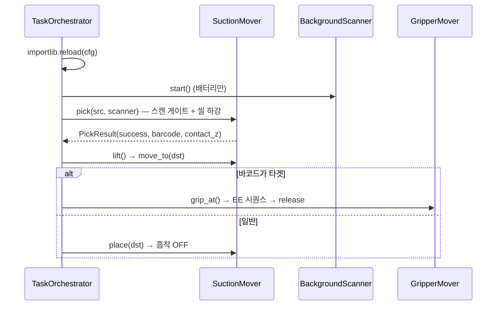

# 케이스 + 배터리 픽앤플레이스 시스템 개요

> Dexmate **Vega 1p** 휴머노이드 로봇을 이용한 배터리 셀 분류/적재 데모.
> 이 문서는 앞부분(1~5장)에서 시스템 전체를 개념 수준으로 설명하고,
> 뒷부분([기술 부록](#기술-부록))에서 모듈 단위 구현을 다룹니다.
>
> 메인 코드: [`LGES/case_battery_demo/`](case_battery_demo/)

---

## 1. 한 줄 요약

흡착 컵(suction)을 단 로봇 팔이 **소스 박스에서 빈 케이스와 배터리를 집어** →
**하강 중 바코드를 읽고** → **타겟 배터리면 반대쪽 그리퍼로 넘겨 따로 격리**,
**아니면 케이스에 안착**시키는 단일 로봇 분류·적재 시스템. 라이브 웹 대시보드와
VLA 학습용 데이터 레코더가 함께 붙어 있습니다.

---

## 2. 하드웨어 구성

| 요소 | 설명 |
|---|---|
| 로봇 | Dexmate **Vega 1p** 휴머노이드 — 양팔 7-DOF + 토르소 3-DOF + 헤드 + 그리퍼/흡착 |
| **왼팔 (suction)** | 끝단에 흡착 컵. 케이스·배터리 픽앤플레이스를 담당하는 주 작업 팔 |
| **오른팔 (gripper)** | Robotiq 2지 그리퍼. 타겟 배터리를 흡착 컵에서 넘겨받아 격리 위치에 놓음 |
| 흡착 컨트롤러 | HTTP `weblogic` 장치 (`192.168.5.1`). 진공 ON/OFF·블로우 제어, 씰 감지(DI0) |
| 바코드 리더 | Cognex DataMan (`192.168.50.101:23`, DMCC over telnet) |
| 헤드 카메라 | ZED (별도 nano `192.168.50.22`에서 dexsensor가 zenoh로 발행) |
| 손목 힘센서 | 양팔 손목 렌치(wrench) — 접촉 감지·과부하 보호에 사용 |

> ⚠️ **토르소는 움직이지 않습니다.** 선택된 팔이 두 박스에 모두 닿아야 하며,
> 닿지 않으면 토르소를 돌리는 대신 **박스 위치를 재배치**하는 것이 이 시스템의 규약입니다.



---

## 3. 작업 흐름 (Forward 시퀀스)

기본 동작은 **3개의 이동(move)**으로 구성되며, 각 이동은 모두
`pick → lift → move_to → place`의 동일한 4단계를 거칩니다.

| # | 이동 | 출발 | 도착 |
|---|---|---|---|
| 1 | `case` | `CASE_PICK` (왼쪽 소스 박스) | `CASE_PLACE_R` (오른쪽 타겟 박스) |
| 2 | `battery_1` | `BAT_SRC_1` | `BAT_SLOT_1` (옮긴 케이스 안) |
| 3 | `battery_2` | `BAT_SRC_2` | `BAT_SLOT_2` |

배터리 이동에서는 픽 단계에 **바코드 스캔 게이트**가 끼어듭니다.



### 핸드오프(타겟 배터리 격리)

타겟 바코드와 일치하거나 **끝내 바코드를 못 읽은** 배터리는 불량/대상으로 간주해
케이스에 넣지 않고 오른쪽 그리퍼로 넘깁니다:

1. 운반 자세에서 오른쪽 그리퍼가 흡착 컵이 쥔 배터리를 옆에서 잡음
2. 흡착 OFF (그립 확인 후)
3. 미리 가르친 EE 포즈 시퀀스([`taught_ee_poses_right.txt`](case_battery_demo/taught_ee_poses_right.txt))를 따라 우하단으로 이동해 release
   (이 동안 흡착 팔은 백그라운드로 기본 자세로 복귀)

---

## 4. 실행 모드

[`run_demo.py`](case_battery_demo/run_demo.py)는 `tyro` CLI로 모드를 받습니다.

| 플래그 | 동작 |
|---|---|
| (없음) | forward 시퀀스 1회 |
| `--undo` | forward 후, 기록된 이동을 역순으로 되돌림 (배터리 먼저, 케이스 나중) |
| `--undo-only` | forward 없이 가르친 포즈에서 undo만 수행 |
| `--loop` | forward + undo 무한 반복 (Ctrl-C까지) |
| `--dashboard` | 라이브 카메라/관절/EE/렌치를 대시보드로 스풀 |
| `--record` | VLA 에피소드 레코더 활성화 (SPACE로 take 시작/정지) |

**적재(stacking)**: `FORWARD_REPEATS > 1`이면 각 패스마다 출발/도착 Z를
`Z_STEP_PER_REPEAT`만큼 보정해 소스 더미는 낮아지고 타겟 더미는 높아집니다.

---

## 5. 부가 시스템 — 대시보드 & 레코더

데모 본체(실시간 제어 루프)와 **완전히 분리된 별도 프로세스**들이 파일 스풀
(`/tmp/cns_dashboard`)을 통해 느슨하게 통신합니다. 무거운 작업(YOLO 추론 등)이
모션 제어 루프를 흔들지 않게 하기 위한 설계입니다.



대시보드 서비스는 [`run_dashboard_demo.sh`](run_dashboard_demo.sh)로 한꺼번에 띄우고,
데모는 별도 터미널에서 실행합니다:

```bash
# 터미널 1 — 대시보드 서비스 (카메라/웹서버/검출/바코드영상)
./run_dashboard_demo.sh

# 터미널 2 — 데모
cd LGES
python -m case_battery_demo.run_demo --dashboard      # 라이브 뷰어와 함께
# 브라우저에서 http://<robot-ip>:8080/
```

---

---

# 기술 부록

## A. 디렉토리 / 모듈 구조

```
LGES/
├── SYSTEM_OVERVIEW.md            ← (이 문서)
├── battery_sorting_paradigm.md   ← 초기 설계 구상(MPC 등은 미구현, 참고용)
├── run_dashboard_demo.sh         ← 대시보드 서비스 일괄 실행
├── utils.py                      ← set_head_pitch 등 공용 헬퍼
└── case_battery_demo/            ← ★ 메인 패키지
    ├── run_demo.py               ← 진입점 (tyro CLI, 안전 프롬프트, 로봇 수명관리)
    ├── sequence.py               ← TaskOrchestrator: forward/undo 시퀀스 + 핸드오프
    ├── grasp.py                  ← ArmMover / SuctionMover / GripperMover (IK + 모션)
    ├── suction_io.py             ← 흡착 HTTP 제어 + VacuumMonitor(DI0 씰)
    ├── bcr.py                    ← 바코드 트리거(T) + BackgroundScanner
    ├── robotiq.py                ← Robotiq 그리퍼 Modbus-RTU 제어
    ├── home_pose.py              ← 기본(Home) 관절 자세로 복귀
    ├── config.py                 ← ★ 모든 매직넘버/튜닝값
    ├── teach_pose.py             ← EE 포즈 티칭 도구
    ├── teach_joint_pose.py       ← 관절 포즈 티칭 도구
    ├── taught_*.txt              ← 가르친 포즈 저장 파일
    └── dashboard/
        ├── publisher.py          ← 라이브 상태를 스풀에 기록(데몬 스레드)
        ├── server.py             ← stdlib 웹 뷰어 (:8080)
        ├── recorder.py           ← VLA 에피소드 레코더 (상태기계)
        ├── detector.py           ← YOLO 빈 검출 오버레이(별도 프로세스)
        ├── barcode.py            ← 바코드 리더 영상 피드(IMAGE.SEND, 트리거 안 함)
        ├── camera_launch.py      ← nano의 head_camera dexsensor 원격 기동(SSH)
        └── camera_geometry.py    ← 깊이 픽셀 → base_link 역투영(빈 높이 계산)
```

> `grasp_box/read_force.py`, `grasp_box/utils.py`는 `sys.path.insert`로
> 서브프로젝트 간 공유됩니다. 공개 API를 깨지 마세요.

---

## B. 제어 스택

### B-1. IK & 모션 (`grasp.py`)

- **솔버**: `pink` + `pinocchio`, QP 솔버 `daqp`
- **태스크**: `FrameTask`(EE 목표) + `PostureTask`(여유 DOF를 관절 중앙으로 정렬) +
  `ConfigurationLimit` / `VelocityLimit`
- **축소 모델**: 토르소를 현재 각도에 잠근 **reduced URDF**(`pin.buildReducedModel`)를
  팔별로 로드 → 솔버가 다른 관절을 건드리지 않게 보장
- **포즈 표현**: 모든 목표는 base_link 프레임의 EE `[x, y, z]` + RPY.
  흡착 접근 자세는 `cfg.GRASP_ORIENTATION_RPY`(컵이 -Z로 수직 하강)
- **궤적 평활화**: Cartesian 직선 보간 + smoothstep(`quintic` 기본) 시간 프로파일,
  서브스텝마다 warm-start IK

`ArmMover`(팔 무관 코어) → `SuctionMover`/`GripperMover`로 상속 분기됩니다.



### B-2. 흡착 픽 — 하강 루프 (`SuctionMover.pick` / `_descent_loop`)

> ※ 초기 구상([paradigm.md](battery_sorting_paradigm.md))의 MPC는 **구현되지 않았습니다.**
> 실제 접촉 제어는 아래의 단계적 하강 루프 + 진공/힘 피드백으로 합니다.

1. 목표 위 `HOVER_HEIGHT_M`까지 이동
2. 흡착 ON
3. `step = clip(목표까지거리 × DESCENT_KP, MIN, MAX)`로 50 ms마다 한 칸씩 하강
4. 종료 조건 중 먼저 오는 것:
   - **진공 씰** (`VacuumMonitor.is_sealed`, DI0가 T) → 성공
   - **접촉 힘** (`FORCE_CONTACT_THRESHOLD_N` 초과) → 성공
   - **과부하** (`FORCE_HARD_LIMIT_N`) 또는 `MAX_DESCENT_M` 초과 → 실패/중단
5. 씰된 z를 기록해 둠 → 같은 이동을 undo할 때 정확히 그 높이로 되돌림

place 하강은 배터리를 들고 있으므로 더 느리고(`PLACE_DESCENT_*`) 힘 한계도
더 타이트(`FORCE_HARD_LIMIT_PLACE_N`)합니다.

### B-3. 흡착 I/O & 씰 감지 (`suction_io.py`)

- 진공/블로우는 weblogic **program ID** 트리거 (`SUCTION_ON_ID` 등)
- **씰 신호는 DI0(`dInput[0]`)** — socketio 스트림의 `VacuumMonitor`가 감시
- ⚠️ `toolA`(펌프 전류)는 **씰 신호로 쓰지 않음**: OFF 유휴 기준값(~0.012 A)이
  펌프 가동 전류(~0.006 A)보다 높아 모호함. 진단 로깅용으로만 노출

### B-4. 바코드 스캔 게이트 (`bcr.py`)

- 한 번 읽기 = telnet으로 `T` 트리거 → 디코드 문자열 반환 (`scan_once`)
- `BackgroundScanner`: 데몬 스레드에서 반복 트리거 → 50 ms 하강 루프를 막지 않음.
  **`BCR_MIN_READS`회 이상 읽혔고 값이 전부 일치할 때만** 결과 확정
- **스캔 게이트**(`BCR_SCAN_GATE_ENABLED`): 흡착 *전에* 접촉 직전까지 내려가
  스캔 → 못 읽으면 살짝 들고 x/y **나선 탐색**(라벨을 리더 시야로 재정렬) → 다시 스캔 →
  복귀 후 흡착. 끝내 못 읽으면 핸드오프로 격리

### B-5. Robotiq 그리퍼 (`robotiq.py`)

- 오른팔 EE **pass-through**(RS485/Modbus-RTU)로 제어 —
  `right_arm.send_ee_pass_through_message`
- move: FC 0x10 @ 0x03E8 / status: FC 0x04 @ 0x07D0
- 위치 0=열림 .. 255=닫힘. 그립 성공은 `gOBJ==2`(물체에서 멈춤) 또는
  `CLOSE_POS - 실제위치 >= ROBOTIQ_GRIP_MIN_GAP`로 판정

---

## C. 시퀀스 오케스트레이션 (`sequence.py`)

- `TaskOrchestrator`가 `Move`(label/src/dst) 리스트를 실행
- 각 `_execute`는 **매 이동 전 `config.py`를 reload** → 루프 중 튜닝값 수정이
  다음 이동에 즉시 반영
- 성공한 이동을 `_done`에 쌓아두고, undo는 이를 역순·src/dst 스왑해 재생
- 픽 시 기록한 실제 씰 z(`actual_pick_z`)를 undo place 높이로 사용
- 핸드오프로 격리된 배터리는 케이스 워크플로우를 벗어나므로 undo 대상에서 제외



---

## D. 데이터 흐름 — 대시보드 & VLA 레코더

- **`DashboardPublisher`** (데몬 스레드): 매 틱 헤드 카메라 RGB → `frame.jpg`,
  관절/EE/렌치 → `state.json`을 **원자적(tmp + os.replace)**으로 스풀.
  EE 포즈는 자체 pinocchio 모델로 계산(SuctionMover 모델은 스레드 안전하지 않음)
- **`server.py`**: 스풀을 폴링하는 stdlib 전용 웹서버. 차트 이력은 브라우저에 누적되어
  서버는 얇은 파일 서버로 유지. 녹화 세션 디렉토리를 가리키면 그대로 재생 가능
- **`recorder.py`**: VLA 에피소드 레코더. 키보드(SPACE/y/n)와 대시보드 버튼이
  하나의 큐를 통해 동일 상태기계를 구동
  `IDLE → RECORDING → DECIDING → (keep|discard) → IDLE`.
  원시 관측만 저장하고, 액션(EE 델타 + 흡착)·페이즈 라벨은 오프라인에서
  `cfg.TRACE_PATH` 조인으로 파생 (관련: [[vla-recording-design]])
- **`detector.py`**: 스풀된 프레임에 YOLO 빈 검출 → `detect.jpg`. 별도 프로세스라
  GPU 추론이 모션 루프를 흔들지 않음
- **`camera_geometry.py`**: 깊이 픽셀을 base_link로 역투영해 빈 중심 높이 측정
  (적재 목표 높이와 비교 표시)

---

## E. 주요 설정값 (`config.py`)

| 상수 | 의미 |
|---|---|
| `ARM_SIDE` / `EE_FRAME` | 흡착 팔 선택 (`left` / `L_gripper_base`) |
| `GRASP_ORIENTATION_RPY` | 흡착 수직 하강 자세 (컵 -Z) |
| `TARGET_BARCODES` | 격리 대상 배터리 바코드 목록 |
| `BCR_MIN_READS` | 결과 확정에 필요한 일치 읽기 횟수 |
| `SAFE_TRANSPORT_Z` | 수평 운반 시 컵 끝단 안전 높이 |
| `DESCENT_*` / `PLACE_DESCENT_*` | 픽/플레이스 하강 속도·게인 |
| `FORCE_CONTACT_THRESHOLD_N` / `FORCE_HARD_LIMIT*_N` | 접촉/과부하 힘 한계 |
| `VACUUM_SEAL_TIMEOUT_S` | 접촉 후 씰 대기 시간 (DI0는 ~3–4s 소요) |
| `HANDOFF_GRIP_OFFSET` | 흡착 EE 대비 그리퍼 그립 오프셋 |
| `TAUGHT_POSES` | 6개 작업 포즈 (CASE/BAT_SRC/BAT_SLOT) |
| `FORWARD_REPEATS` / `Z_STEP_PER_REPEAT` | 적재 반복 횟수와 패스별 Z 보정 |

---

## F. 환경 & 규약

- **Python 3.12** (`/opt/venv/`), 의존성 사전설치(dexcontrol, dexmotion, pink,
  pinocchio, qpsolvers, numpy, tyro, loguru, scipy). 개발 컨테이너가 유일 지원 런타임
- **URDF**: `/opt/venv/.../vega_1p/vega_1p_gripper.urdf`
- **필수 env**: `ROBOT_NAME`, `ZENOH_CONFIG` (`.dzcfg` 경로)
- **포지션 모드**: `arm.set_joint_pos`는 `set_modes(["position"]*7)` + 소프트웨어
  E-Stop 해제 후에만 동작 (`SuctionMover.ensure_ready`)
- **안전 프롬프트**: 로봇을 움직이는 스크립트는 `logger.warning` 후 `y/N` 확인 필수.
  테스트라도 우회 금지
- **로깅**: `loguru`, 포맷은 f-string이 아닌 `{}`(지연 평가)
- **CLI**: `tyro.cli(@dataclass)` 사용, `argparse` 금지
- 테스트 스위트 없음 — 검증은 실로봇에서 수동. 로봇을 움직이는 스크립트를
  에이전트가 임의로 실행하지 말고 명령만 제시할 것

---

## G. 관련 문서

- [`AGENTS.md`](../AGENTS.md) — 워크스페이스 전체 오리엔테이션
- [`case_battery_demo/README.md`](case_battery_demo/README.md) — `_execute` 흐름 요약
- [`battery_sorting_paradigm.md`](battery_sorting_paradigm.md) — 초기 설계 구상(일부 미구현)
- [`dashboard/REVIEW_DASHBOARD_DESIGN.md`](case_battery_demo/dashboard/REVIEW_DASHBOARD_DESIGN.md) — 리뷰 대시보드 설계
